# 设计文档

## 前言&#x20;

为了避免视觉传达差异，使用特定的调色板来规定颜色，为你所搭建的产品提供一致的外观视觉感受。可以高效地对组件外观进行调整或创造自己的主题，以满足业务和品牌上多样化的视觉需求，包括但不限于全局样式（颜色、图片）。 默认提供黑白两套预设主题，可以通过修改参数快速生成风格迥异的主题。

## 设计规范 

### 黑色主题 

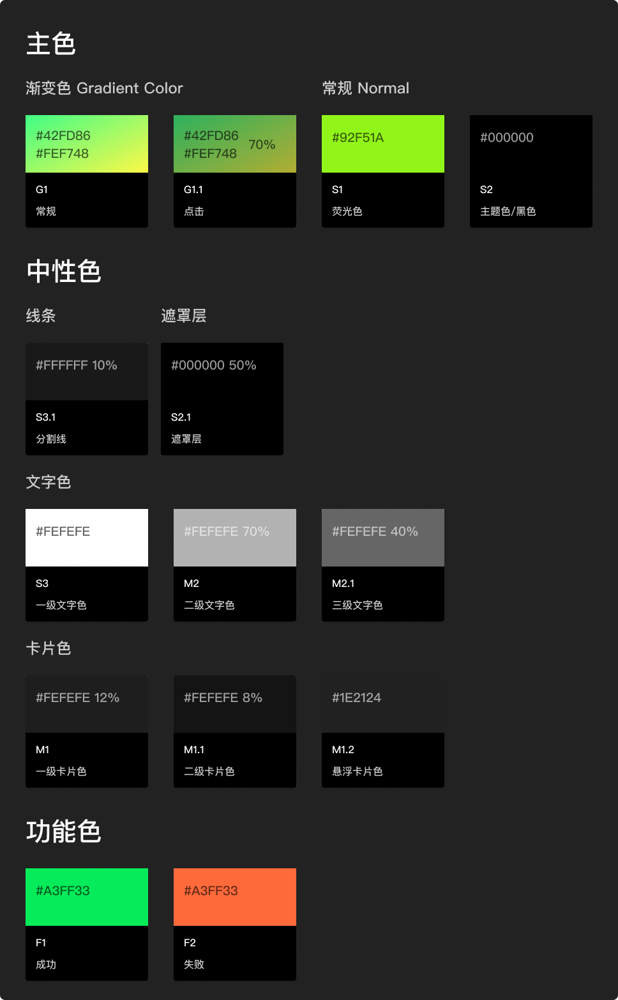/

### 白色主题 

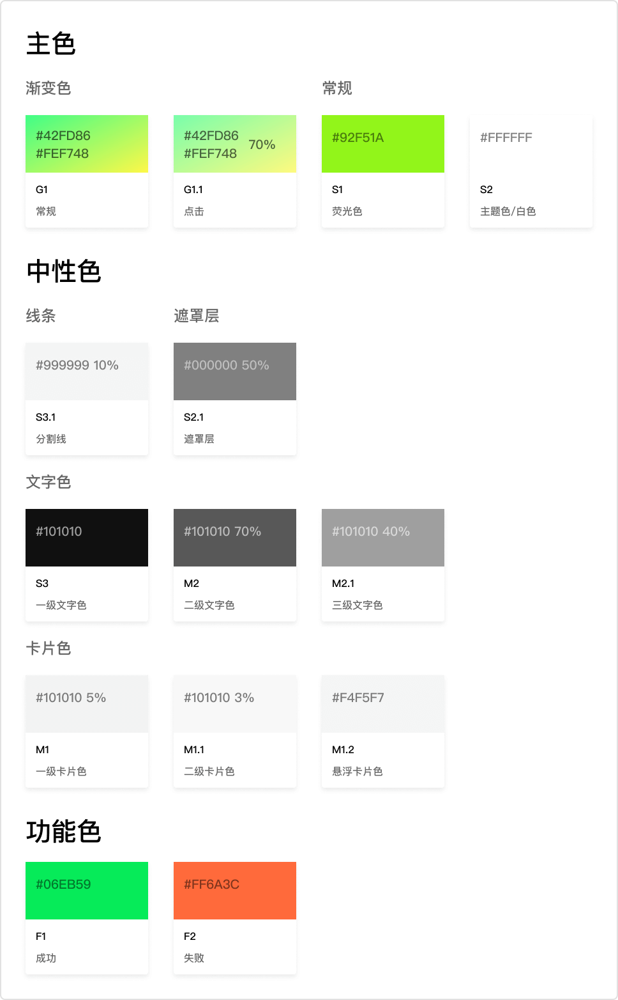

### 黑白主题通用组件 

颜色不随主题切换而变化

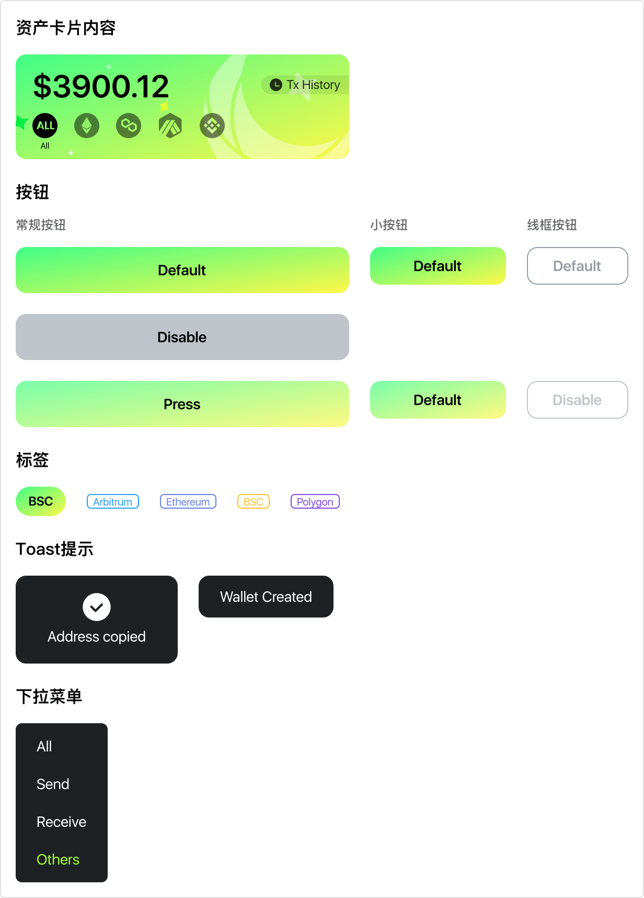

### 黑白主题通用切图 

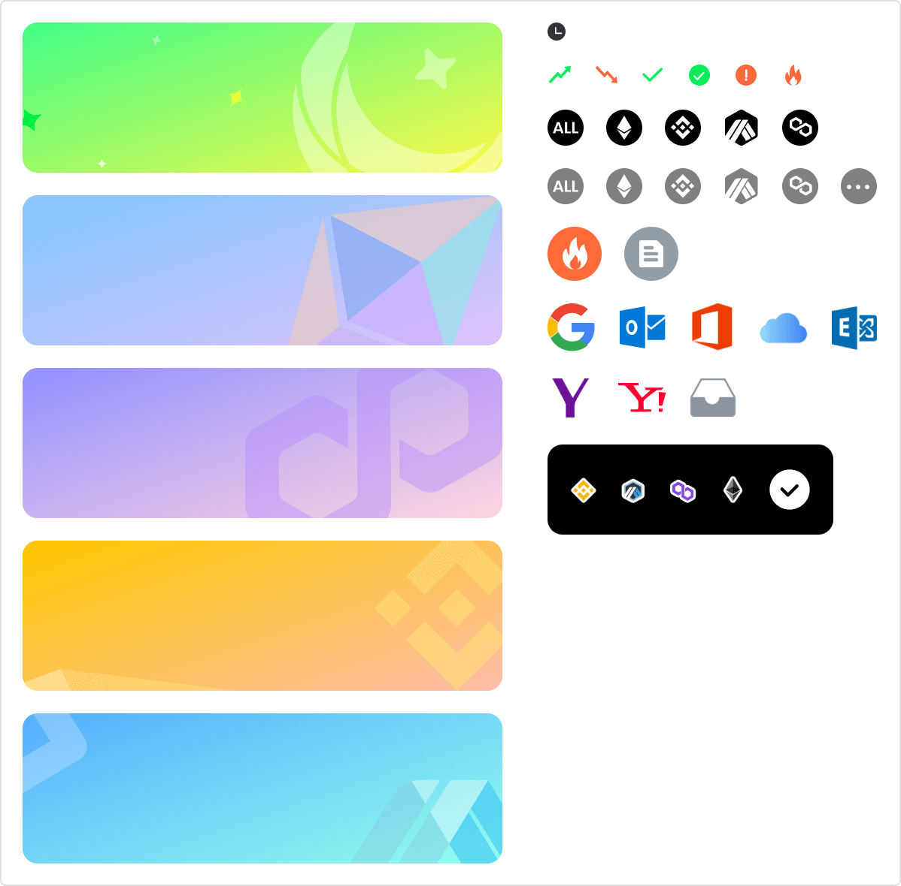

### 黑白主题不通用切图 

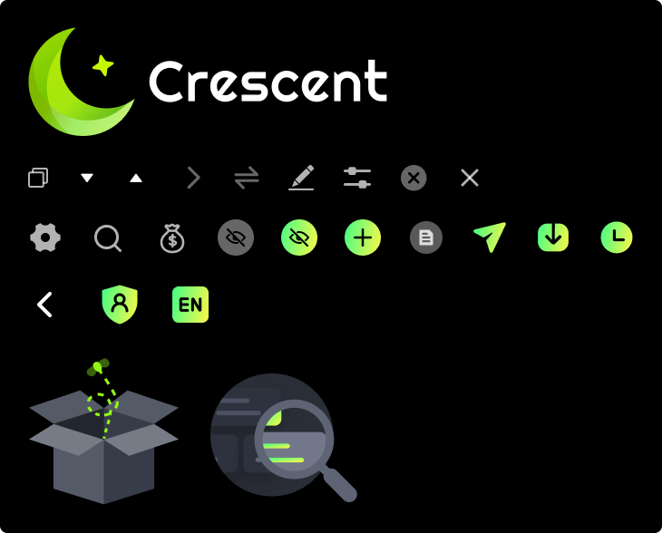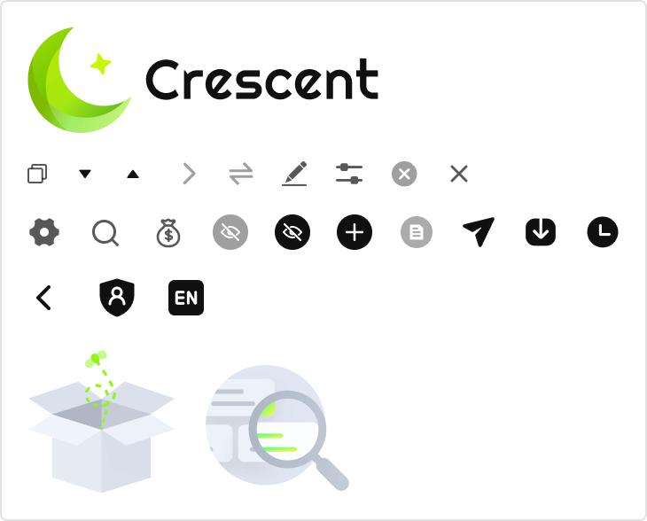

### 特殊情况 

红框内文字需要特殊处理颜色

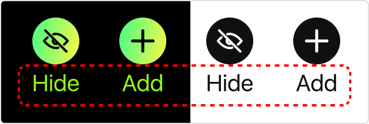

## 自定义主题&#x20;

根据品牌的风格选择白色或者黑色主题进行自定义。你可以对以下所有颜色进行自定义，同时也可以修改以下列出的图片来达到品牌风格统一。&#x20;

### 通用修改&#x20;

#### 颜色

品牌色

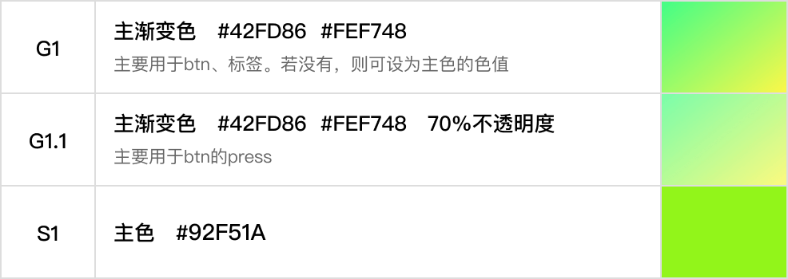

功能色

图片

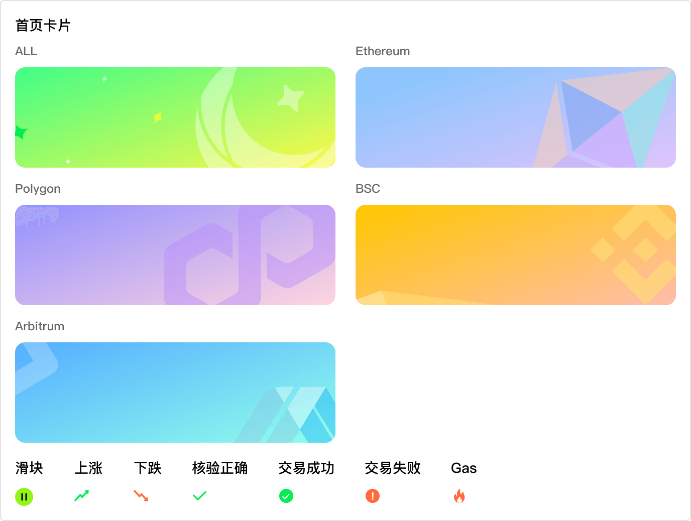

Loading

### 基于黑色主题修改 

#### **颜色**

主题色

#### **中性色**

文字颜色

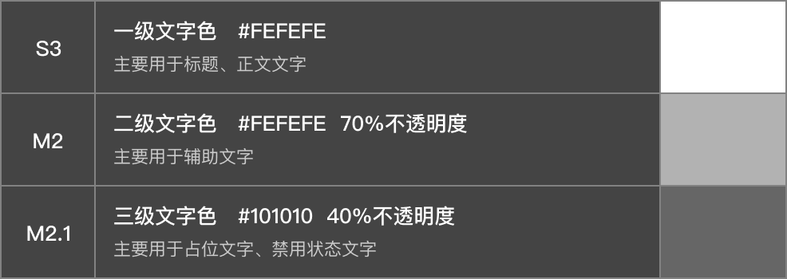

卡片颜色

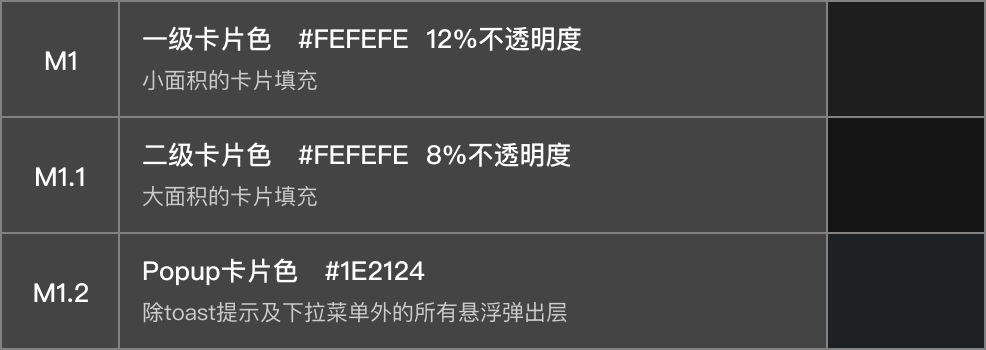

#### 图片&#x20;

Logo

Icon

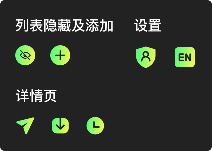

空状态

### 基于白色主题修改&#x20;

#### 颜色

主题色

#### 中性色&#x20;

文字颜色

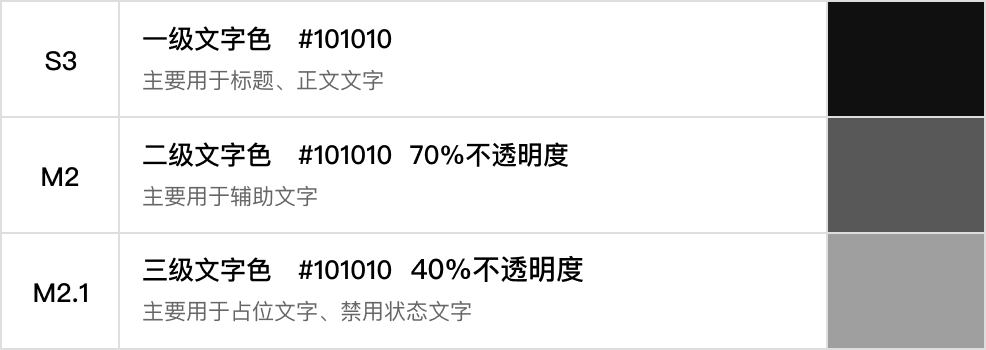

卡片颜色

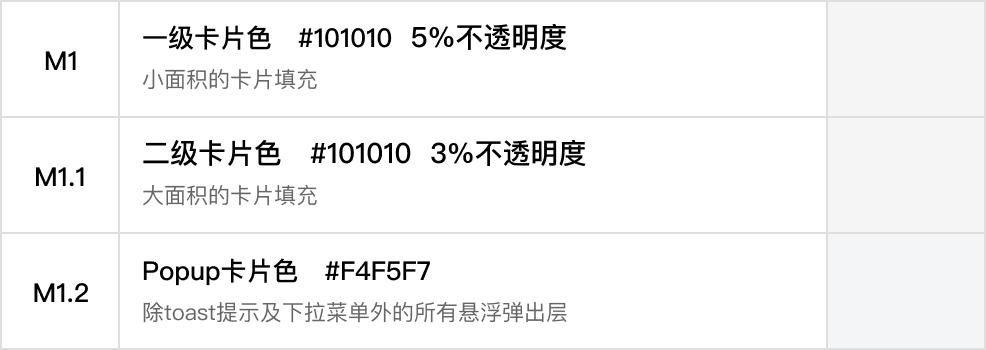

#### 图片&#x20;

Logo

Icon

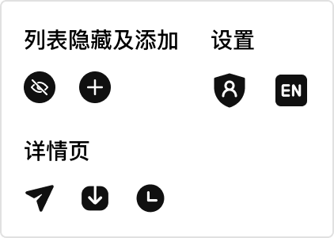

空状态

